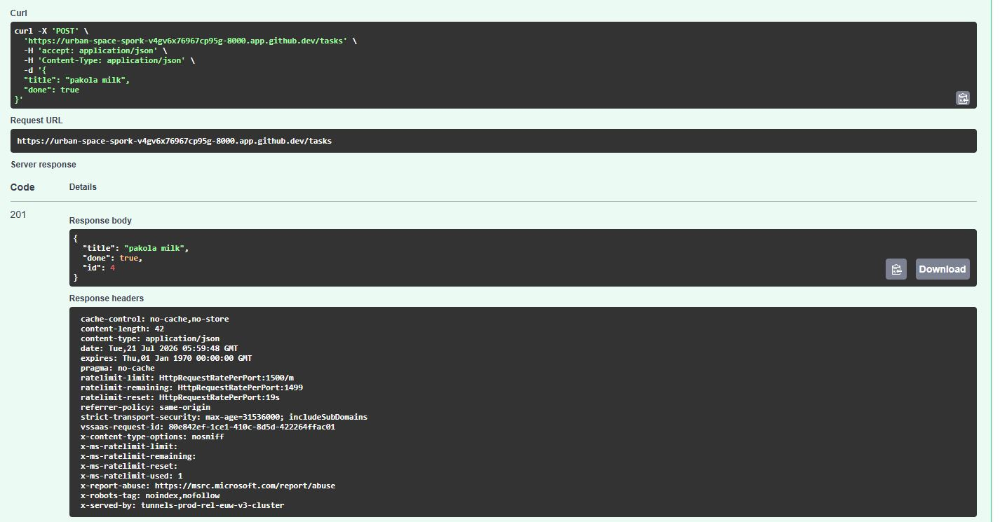
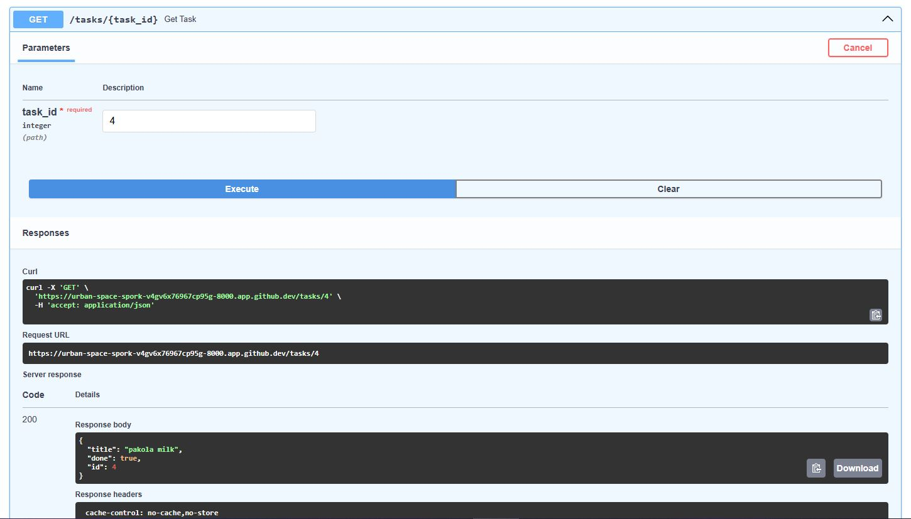
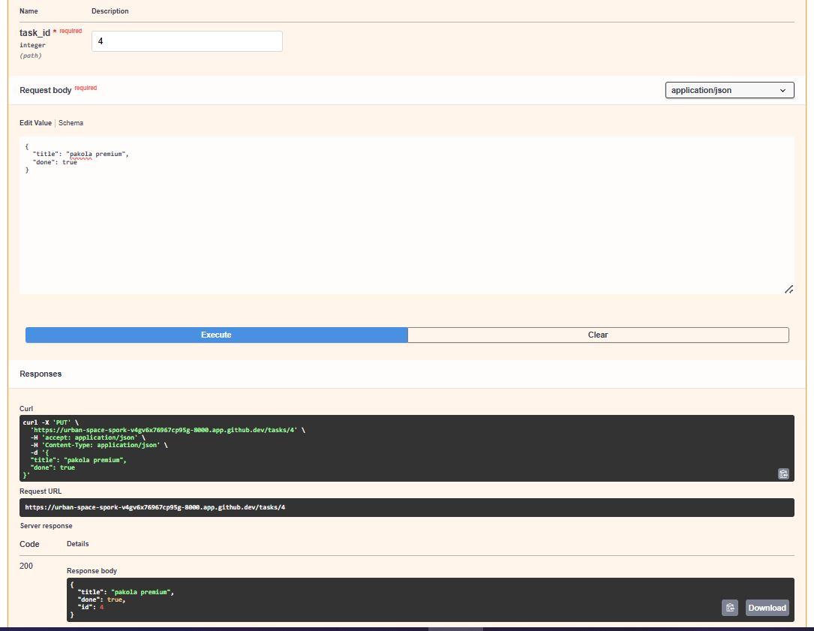
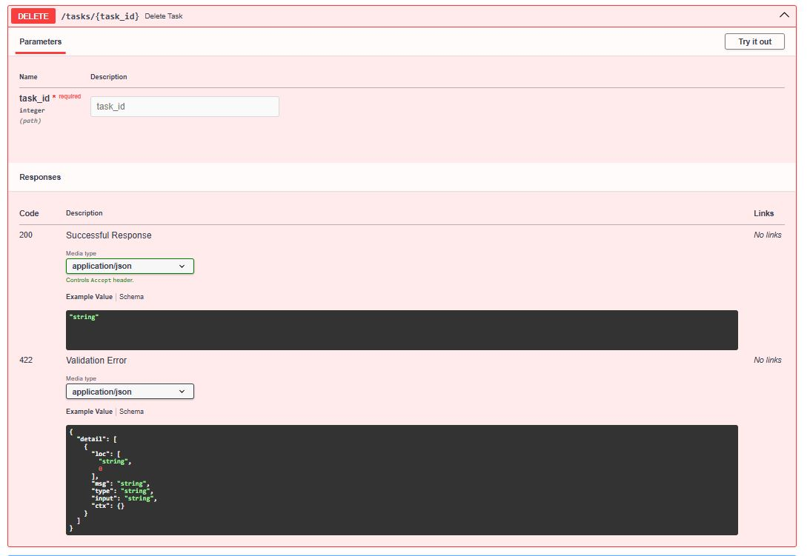
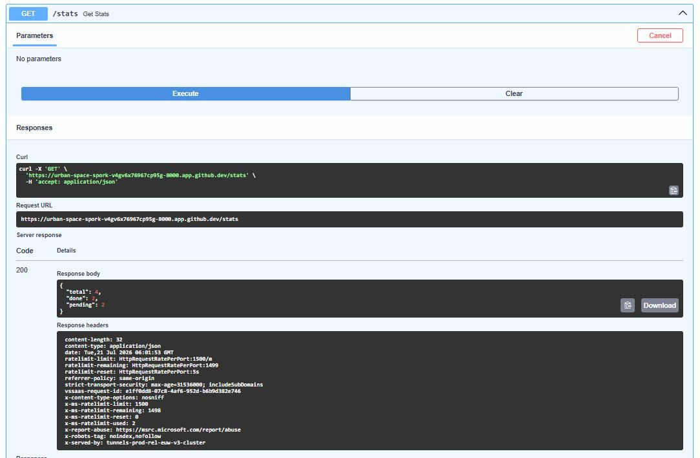

# W3 · A2 — Connecting your CRUD to the database


**Assignment:** A2 — Connecting to the database — FlyRank Internship

## What changed from Assignment 1

The API is identical — same routes, same request bodies, same response shapes. The only thing that changed is where the data lives:

```
Before:  Client -> API -> Array in memory   (gone on every restart)
Now:     Client -> API -> SQLite database   (survives restarts)
```

## Why SQLite

SQLite needs no separate server or installation — the whole database is a single file (`tasks.db`) that the app creates automatically the first time it runs. That makes it the right tool for a small, single-process API like this one: zero setup, and it's trivial to inspect the file directly with a SQLite viewer while developing. The same code pattern (SQLModel + an `engine`) is what scales later to Postgres or MySQL by changing one connection string — nothing about the API or the model layer has to change.

## Where the database file is stored

`tasks.db` is created in the project's root directory (same folder as `main.py`), the first time the app starts. It's git-ignored — each clone generates its own fresh copy with the 3 seed tasks.

## Project structure

```
W3-A2-database/
├── main.py            # FastAPI app, routes, seeding logic
├── models.py           # Task table schema (SQLModel)
├── database.py         # Engine + session setup
├── requirements.txt
└── README.md
```

## How to run

```bash
pip install -r requirements.txt
uvicorn main:app --reload
```

Visit `http://127.0.0.1:8000/docs` for interactive Swagger UI, or hit the endpoints directly:

| Method | Route | Behavior |
|---|---|---|
| GET | `/tasks` | List all tasks |
| GET | `/tasks/{id}` | Get one task, 404 if missing |
| POST | `/tasks` | Create a task, 400 if title missing, 201 on success |
| PUT | `/tasks/{id}` | Update a task's title and/or done status |
| DELETE | `/tasks/{id}` | Delete a task |
| GET | `/stats` | Extra — total/done/pending counts via SQL `COUNT()` |

**Note:** there is no route at `/` (the app's root) — only the routes above are defined, so visiting the bare URL correctly returns `{"detail":"Not Found"}`. That's expected FastAPI behavior, not a bug.

## Testing evidence

All CRUD operations tested end-to-end against the live SQLite-backed API:

**POST /tasks — create**


**GET /tasks/{id} — read by id**


**PUT /tasks/{id} — update**


**DELETE /tasks/{id} — delete**


**GET /stats — extra endpoint**


## Example SQL query run against the database

Opened `tasks.db` in DB Browser for SQLite and ran:

```sql
SELECT * FROM tasks WHERE done = 1;
```

This returned only the completed tasks — confirmed the API's `GET /tasks` reflected the same data immediately after, with no restart needed. That's the core idea of this assignment: the database is the single source of truth, and the API is just a window into it.

## Database viewer screenshot (Stage 4)

_Still needed: a screenshot of `tasks.db` opened directly in a SQLite viewer (DB Browser for SQLite, or the VS Code SQLite extension) showing the `tasks` table and its rows — this is separate from the CRUD test screenshots above, and confirms you inspected the raw database, not just the API responses._

## Checklist

- [x] Same CRUD endpoints as Assignment 1, unchanged
- [x] Tasks stored in SQLite, not memory
- [x] Data survives server restarts (verified: killed process, restarted, data intact)
- [x] Database file created automatically if missing
- [x] `tasks` table created automatically if missing
- [x] 3 example tasks inserted only on first run (verified: no duplicates across restarts)
- [x] All CRUD operations use SQL queries via SQLModel
- [x] Unknown ids return 404
- [x] Invalid requests (missing title) return 400
- [x] CRUD operations tested end-to-end with screenshots (create, read, update, delete, stats)
- [ ] Database viewer screenshot added (still needed — see Stage 4 section above)