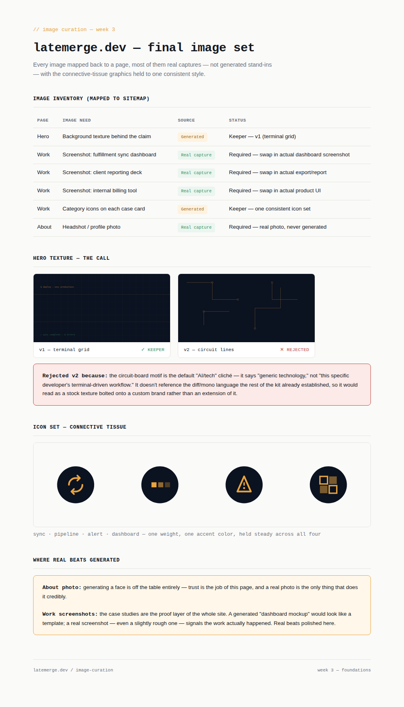
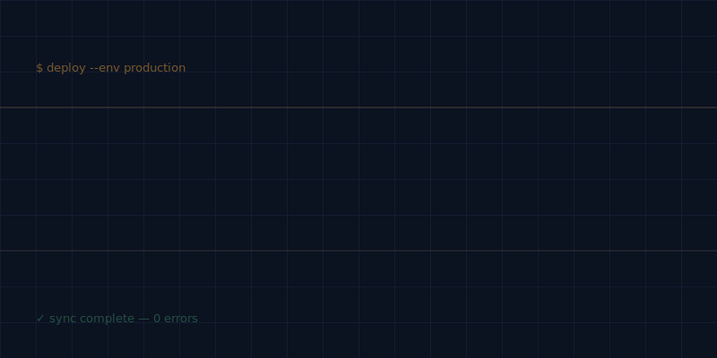
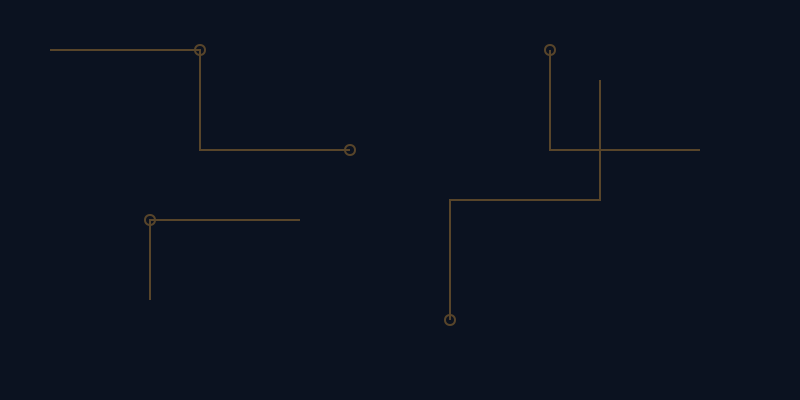

# Week 3 — Curate Your Images

**Assignment:** Kill your darlings: Curate Your Images — FlyRank Internship

## Overview

The job here wasn't to generate images — it was to decide which images the portfolio actually needs, then be ruthless about which of those should be real captures versus generated connective tissue. Most of a good portfolio is real: screenshots of actual work, a real photo of the person. Generation is reserved for the glue between those things — hero textures, icons — and even there it has to hold one consistent style, not become a pile of one-off assets.

This builds directly on `W3-identity-kit`: every generated asset here reuses that kit's palette (`#0B1220` navy, `#E8A33D` gold) and typography, so nothing introduced in this pass drifts from the system already locked.

## Contents

| File | Description |
|---|---|
| `image-curation.html` | Single-page summary: full image inventory mapped to the sitemap, the hero texture decision (keeper vs. rejected), the icon set, and the real-vs-generated judgment notes. |
| `image-curation-preview.png` | Rendered screenshot of the page above, for quick reference without opening the HTML. |
| `hero-texture-v1-accepted.svg` | Kept — terminal grid pattern with faint command-line text, extends the identity kit's mono/diff language. |
| `hero-texture-v2-rejected.svg` | Rejected — circuit-board pattern, kept in the folder as the documented "why not" for the discernment record. |
| `icon-set-accepted.svg` | Four line icons (sync, pipeline, alert, dashboard) for the work-card categories, one weight and one accent color throughout. |

## Image inventory

| Page | Image need | Source | Status |
|---|---|---|---|
| Hero | Background texture | Generated | Keeper — v1, terminal grid |
| Work | Fulfillment sync dashboard screenshot | **Real capture required** | Placeholder only — swap for actual screenshot |
| Work | Client reporting deck screenshot | **Real capture required** | Placeholder only — swap for actual screenshot |
| Work | Internal billing tool screenshot | **Real capture required** | Placeholder only — swap for actual screenshot |
| Work | Category icons on case cards | Generated | Keeper — one consistent set |
| About | Headshot | **Real photo required** | Never generated — trust-critical |

## The rejection call

**Rejected:** `hero-texture-v2-rejected.svg` (circuit-board lines)

| Kept — `hero-texture-v1-accepted.svg` | Rejected — `hero-texture-v2-rejected.svg` |
|---|---|
|  |  |

**Why:** it's the default "AI/tech" visual cliché — nodes and traces read as generic technology, not as this specific developer's terminal-driven workflow. It doesn't extend the diff/mono language the identity kit already established, so it would sit on the page as a stock texture bolted onto a custom brand rather than a natural extension of it. `v1` (terminal grid + faint command-line text) won because it's legible as *this* brand specifically, not swappable with any other dev portfolio.

## Icon set

Four line icons — sync, pipeline, alert, dashboard — one weight, one accent color, held steady across all four so they read as a set rather than four separate choices.

## Where real beats generated

- **About photo** — off the table for generation entirely. This page's only job is trust, and a generated face can't do that credibly regardless of quality.
- **Work screenshots** — these are the proof layer of the whole site. A generated "dashboard mockup" reads as a template; a real screenshot, even imperfect, signals the work actually happened. Polish loses to authenticity here.

## Pass / revise checklist (per assignment brief)

- [x] Images map to real needs — inventory above ties every image to a specific sitemap page
- [x] Work is shown with real captures, not AI stand-ins — three screenshots flagged as required real captures, not generated
- [x] AI-generated images share one consistent style/mood — hero texture and icon set both reuse the identity kit's exact palette and type
- [x] Real photo used where the subject is the person — About headshot flagged as never-generate
- [x] Rejection note shows genuine judgment — see "The rejection call" above, reasoned against the brand system, not just preference

## Next step

Before this ships, the three "required real capture" rows need actual screenshots and a real headshot dropped in — this folder currently documents the *decision*, not the final asset set. Swap the placeholders, keep the file names, and the page above updates to reflect the real portfolio.
