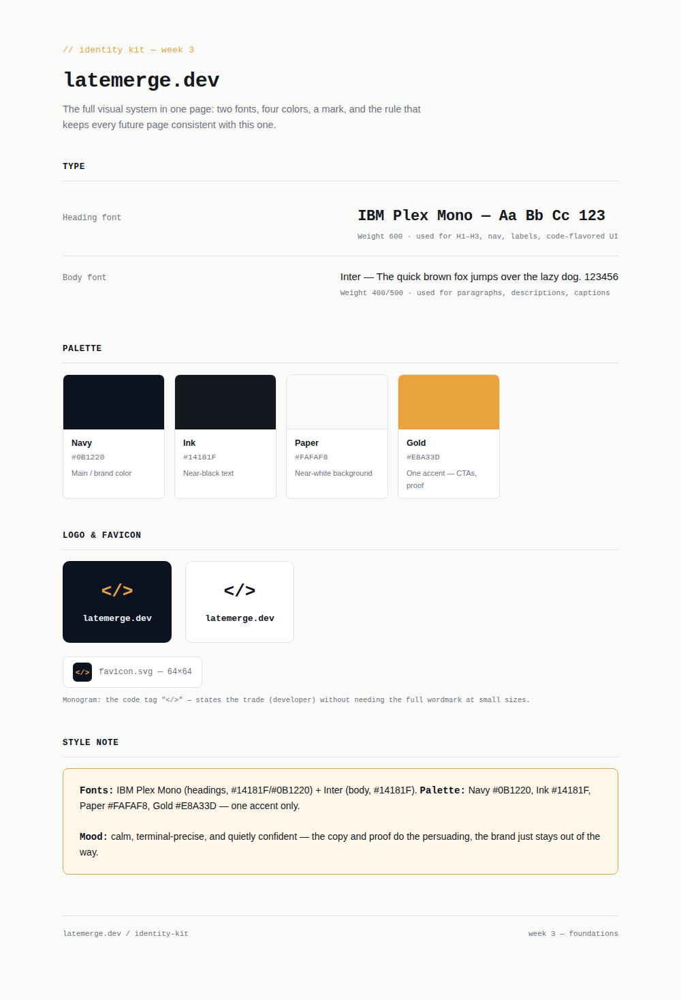

# Week 3 — Identity Kit


**Assignment:** Decide Once: Build Your Identity Kit — FlyRank Internship



## Overview

This folder contains the visual identity system for `latemerge.dev`, a portfolio site for a backend developer selling custom automation builds. The brief for this week was to make a handful of design decisions **once** — typography, color, and mark — so that every future page inherits them automatically instead of re-deciding style on each new page.

This identity kit is not a standalone design exercise. It's built on top of the sitemap and landing page from Week 1–2 of this track (claim: *"I remove manual work from ops teams"*; action: *book a build call*), and it exists to lock the visual language those pages already used so nothing drifts as the site grows.

## Contents

| File | Description |
|---|---|
| `identity-kit.html` | Single-page reference sheet: type specimens, full color palette with hex codes, logo/favicon lockups, and the style note. This is the "source of truth" page — open it any time a new page's styling needs checking against the system. |
| `favicon.svg` | Standalone, production-ready favicon asset (64×64, scalable). Drop directly into a site's `/public` folder and reference from `<link rel="icon">`. |
| `README.md` | This file. |

## Design system

### Typography


- **Heading font:** IBM Plex Mono, weight 600 — used for H1–H3, nav labels, and any "code-flavored" UI element (buttons, tags, terminal-style diff blocks).
- **Body font:** Inter, weights 400/500 — used for paragraphs, descriptions, and captions.
- **Rule:** two fonts maximum, no exceptions. Monospace signals "developer" without needing an illustration; Inter keeps long-form copy readable.

### Color palette


| Name | Hex | Role |
|---|---|---|
| Navy | `#0B1220` | Main / brand color — dark surfaces, primary UI weight |
| Ink | `#14181F` | Near-black text on light backgrounds |
| Paper | `#FAFAF8` | Near-white background |
| Gold | `#E8A33D` | Single accent — reserved for CTAs and proof points only |

Four colors total, one of them an accent. Gold is intentionally rationed — it only appears where something needs to win the visitor's eye (a button, a metric, a highlighted line in a diff), so it never gets diluted into decoration.

### Logo & favicon
The mark is the code tag `</>`, set in the heading font. It states "developer" in two characters, reads at any size down to a 16px favicon, and needs no illustration or full wordmark to be recognizable. Two lockups are included: on-navy (primary, for dark surfaces) and on-paper (light, for light surfaces).

### Style note (for reuse in prompts / project instructions)
> **Fonts:** IBM Plex Mono (headings) + Inter (body). **Palette:** Navy `#0B1220`, Ink `#14181F`, Paper `#FAFAF8`, Gold `#E8A33D` — one accent only.
> **Mood:** calm, terminal-precise, and quietly confident — the copy and proof do the persuading, the brand just stays out of the way.

This note is pasted verbatim into the project's Claude Project custom instructions, so every future page generated in that project inherits the same system without it being re-specified each time.

## Architecture / how this fits the larger build

```
Claim + one action (Week 1)
        │
        ▼
Sitemap (Week 1) ──► Landing page draft (Week 2)
        │
        ▼
Identity Kit (Week 3, this folder)  ◄── locks type / color / mark
        │
        ▼
All future pages reference this kit — no re-deciding style per page
```

The identity kit sits between "structure" (sitemap, page-by-page proof logic) and "execution" (actual page builds). Nothing here is decorative-first — every choice traces back to the claim: a developer-facing offer needs a developer-coded visual language (monospace, terminal/diff motifs, restrained color) rather than a generic "portfolio" look.

## Usage

- Open `identity-kit.html` directly in a browser — no build step, no dependencies beyond Google Fonts (IBM Plex Mono, Inter), loaded via CDN link in the `<head>`.
- Use `favicon.svg` as-is, or export to `.ico`/`.png` sizes as needed for broader browser support.
- Any new page added to this portfolio should be checked against this kit's palette and type rules before it's considered "on-brand."

## Pass / revise checklist (per assignment brief)

- [x] One or two fonts, not a pile — IBM Plex Mono + Inter
- [x] Tight palette (~3–4 colors) with actual hex codes — 4 colors, all hex-coded above
- [x] A simple logo/favicon exists — `</>` monogram, both lockups + standalone favicon file
- [x] Style note describes a single, coherent mood — see above, pasted into Claude Project instructions