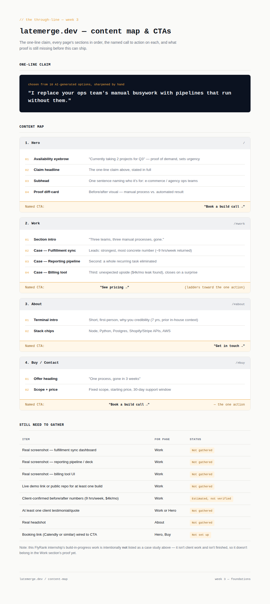

# Week 3 — The Through-Line: Map Content & CTAs

**Assignment:** The Through-Line: Map Content & CTAs — FlyRank Internship

## Overview

This is the bridge from words to a working portfolio: one sentence stating the claim, then a page-by-page map of exactly what goes where, in what order, and what each page asks the visitor to do next. Every named CTA on every page ladders up to the single action from Week 1 — book a build call — so nothing on the site competes with itself for the visitor's next click.

Builds directly on `W3-identity-kit` (type/palette) and the Week 1–2 sitemap (Hero → Work → About → Buy). This pass doesn't touch visuals — it locks the content order and the CTA logic underneath them.

## Contents

| File | Description |
|---|---|
| `content-map.html` | Single-page deliverable: the one-line claim, the full content map (page → ordered sections → named CTA), and the "still need to gather" proof list. |
| `content-map-preview.png` | Rendered screenshot of the page above. |

## One-line claim

> "I replace your ops team's manual busywork with pipelines that run without them."

Chosen from 10 AI-generated options, then sharpened by hand — kept because it's a full sentence someone could repeat back after one read, not a paragraph of positioning language.

## Content map summary

| Page | Sections (in order) | Named CTA |
|---|---|---|
| Hero | Availability eyebrow → claim headline → subhead → proof diff-card | **Book a build call →** |
| Work | Section intro → fulfillment sync (leads, strongest number) → reporting pipeline → billing tool (closes on the surprise result) | **See pricing →** |
| About | Terminal-style intro → stack chips | **Get in touch →** |
| Buy | Offer heading → scope + price | **Book a build call →** (the one action) |

Work leads with its most concrete, most quantifiable case — the fulfillment sync (~9 hrs/week returned) — and closes with the one that has the biggest surprise payoff (a $4k/mo billing leak found), so the section opens on credibility and ends on a reason to keep reading toward Buy.

## Still need to gather

Honest gaps, not filled in with placeholders pretending to be real:

- Real screenshots for all three Work case studies (currently described, not captured)
- A live demo link or public repo for at least one build
- Client-confirmed before/after numbers — the 9 hrs/week and $4k/mo figures are estimates, not yet verified
- At least one client testimonial
- A real headshot for About
- A working booking link wired to both CTA buttons

This FlyRank internship build itself is deliberately left off the Work section — it isn't client work and isn't finished, so it doesn't belong in the proof section yet.

## Pass / revise checklist (per assignment brief)

- [x] A single, memorable claim, not a paragraph
- [x] Every page has ordered sections and a named CTA; the strongest work leads
- [x] All CTAs ladder up to the one action from Week 1 (book a build call)
- [x] The gather-list is honest, so the build week isn't blocked by unverified claims